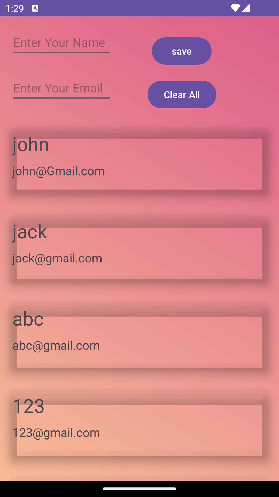

# Contact Manager App

It is an andorid application built in kotlin for the users to store contacts , consisting of fields like name , email id and Phone Number. It stores the contacts on the ui itself and the user can create a new contact , modify an existing contact and delete a contact. It uses recycler view tp create a list view of contacts stored in the UI itself , using ROOM database.

# Technology used

- Android Studio
- Kotlin
- ROOM database

# Install the Project

```git
git clone https://github.com/Sachdevabhavya/ContactManagerApp.git
```

# dependencies required

Add the following dependencies to run the app in the following file given :

- build.gradle.kts(module)

```kt
    implementation("androidx.room:room-runtime:2.6.1")
    implementation("androidx.room:room-ktx:2.6.1")
    kapt("androidx.room:room-compiler:2.6.1")
    implementation("org.jetbrains.kotlinx:kotlinx-coroutines-android:1.7.1")
    val lifecycle_version = "2.6.2"
    //View Model
    implementation("androidx.lifecycle:lifecycle-viewmodel-ktx:$lifecycle_version")

    //Live Data
    implementation("androidx.lifecycle:lifecycle-livedata-ktx:$lifecycle_version")
```

# Update SDK in Build.gradle

```kt
compile Sdk = 34
target Sdk = 34
```

# plugins required

Add the following plugins to run the app in their respective file given :

- build.gradle.kts(module)

```kt
id("kotlin-kapt")
```

- build.gradle.kts(project)

```kt
kotlin("kapt") version "1.9.22"
```

# Set dataBindable

In Build.gradle file add the following code in android :

```kt
buildFeatures{
    dataBinding = true
}

```

# Features

<p align="center">
  
  
</p>

- User can add their contacts :
  

- User can update the existing contact :
  

- User can delete any contact :
  

- The contacts will remain stored even if the app is stopped , because the data is stored using a ROOM database


# Android Verion

This app is made for android 7 and above versions

# Recent Updates

- Phone Number field is also added
